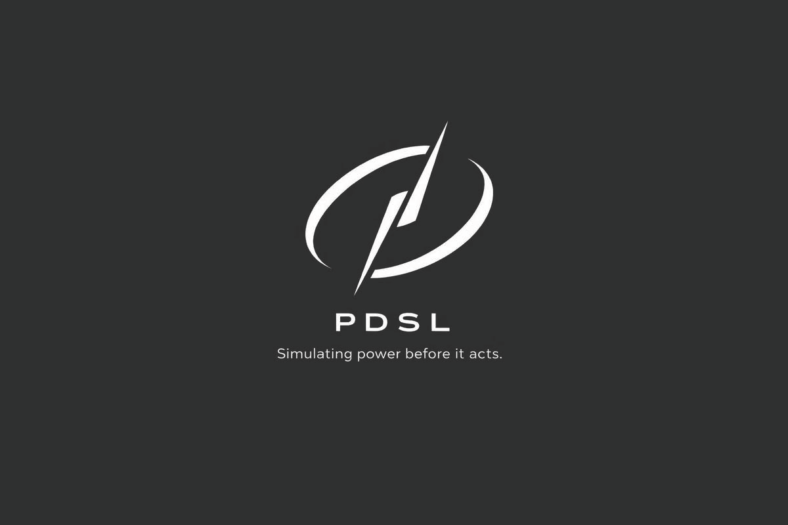

# Public Diplomacy Simulation Lab (PDSL)
## Public, review-facing documentation

{ width="720" }

**Release anchor:** `v0.1.2-review-ready` (GitHub Release)  
**DOI (Zenodo, citable archive):** https://doi.org/10.5281/zenodo.18732275  
**Author / Owner:** Frantz Damas

Public diplomacy now operates inside algorithmically governed environments—systems that curate visibility, prioritize affect, and shape attention at scale. The **Public Diplomacy Simulation Lab (PDSL)** is a **deterministic, theory-constrained simulation framework** built to support **controlled scenario reasoning** and **regime-based interpretation** in these environments.

PDSL is **not** a forecasting system and does **not** perform causal inference. It is a governance-first analytical artifact designed for reviewability, interpretability, and disciplined use.

## Start here
- **Scope and non-claims:** Model Card  
- **Interpretive logic:** Methods Note  
- **Review discipline:** Review Protocol  
- **Brand + public positioning:** Brand Coherence Layer

## Appropriate uses
- Compare policy levers under controlled conditions  
- Stress-test narrative scenarios without operational deployment  
- Train analysts and diplomats in structured decision environments  
- Evaluate interpretive regimes to reduce misuse and over-claiming  

## Inappropriate uses
- Predict public opinion or real-world outcomes  
- Make causal claims or treatment-effect estimates  
- Automate decisions or recommendations  
- Enable targeting, personalization, or operational influence campaigns  

## Citation
Cite this documentation release using:
1) the **tagged release** (`v0.1.2-review-ready`) and  
2) the repository metadata file (`CITATION.cff`).  

For a stable archival citation, use the Zenodo DOI: https://doi.org/10.5281/zenodo.18732275
